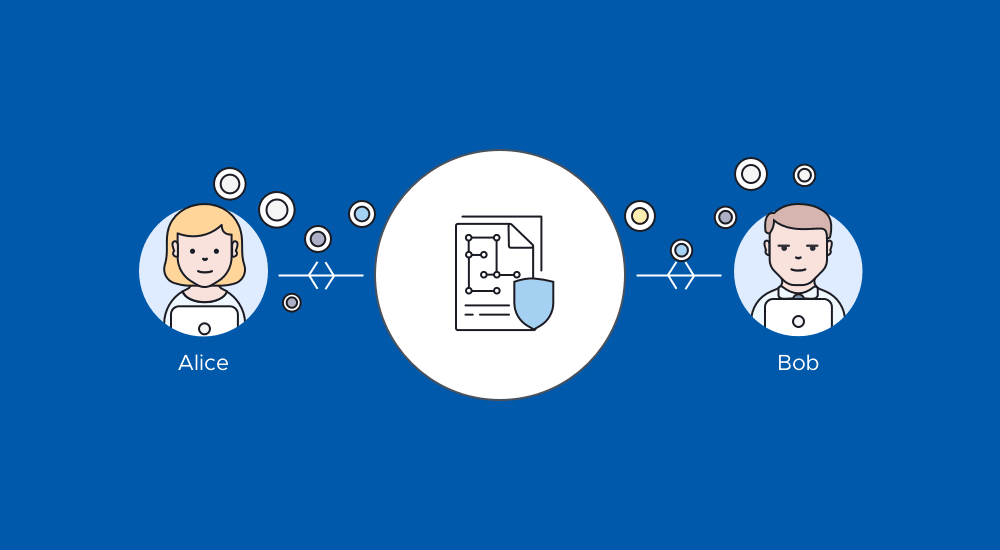

# Smart Contracts with Solidity

Using Solidity we will create three different smart contracts.

## 1. Pay Your Associate-Level Employees Quickly and Easily

The `AssociateProfitSplitter` contract will accept Ether into the contract and divide the Ether evenly among the associate level employees. This will allow the Human Resources department to pay employees quickly and efficiently.

Kovan Smart Contract Address `0x9092FFb1Bc21784AE94580A17780adBB8485F476`

## 2. Distribute Profits to Different Tiers of Employees

The `TieredProfitSplitter` contract will distribute different percentages of incoming Ether to employees at different tiers/levels. For example, the CEO gets paid 60%, CTO 25%, and Bob gets 15%.

Kovan Smart Contract Address
`0xE08d01311251774317C244A2CA2A32865bf099F5`

## 3. Distribute Company Shares for Employees in a "Deferred Equity Incentive Plan" Automatically

The `DeferredEquityPlan` contract models traditional company stock plans. This contract will automatically manage 1000 shares with an annual distribution of 250 over 4 years for a single employee.

Kovan Smart Contract Address
`0x2Ba8F8684DeD6344fc71D401bd73672e86266733`